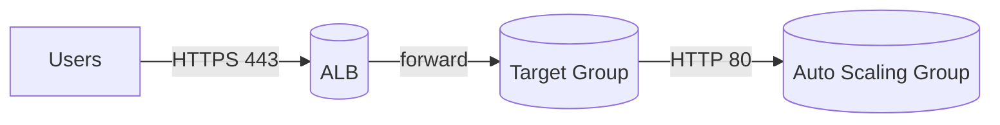
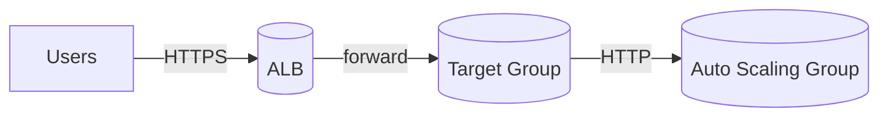

# Resilient Web Tier on AWS — ALB + Auto Scaling (Design-as-Code)

## 🎯 Goal
Translate Elastic Load Balancing + Auto Scaling fundamentals into a **production-grade blueprint** that is deployable later.  
**Phase-1 is plan-only** to keep operational cost at zero, while establishing architecture, documentation, and IaC structure.

---

## 📦 Scope (Phase-1 Only)
- Application Load Balancer (ALB): Listeners, Rules, Actions, TLS offloading (ACM), optional stickiness.
- Target Groups (HTTP), Health Checks, Deregistration Delay.
- Cross-Zone Load Balancing (ALB).
- Auto Scaling Group (ASG) + Launch Template.
- Lifecycle Hooks (Pending:Wait / Terminating:Wait).
- Termination Policies oriented to AZ balance.
- Observability hooks (CloudWatch metrics) **by design**.
- Security boundary: ALB SG → ASG SG only.

> Out of scope in Phase-1: CI/CD, containerization, K8s, or any real `apply`.  
> Those arrive in Phase-2 (DevOps tooling).

---

## 📐 Architecture (High-Level)

- ALB in **public subnets** across ≥2 AZs.  
- ASG in **private subnets** across the same AZs.  
- TG Health Check: `GET /health` expecting `200–399`.  
- TLS: Offloaded at ALB using ACM + SNI (when deployed).  
- Prefer stateless apps; stickiness optional and short-lived.

### 🗺️ Architecture Diagram

## 🔒 Security Model

- **ALB Security Group:** allow inbound `443/tcp` & `80/tcp` from the internet; egress open.  
- **ASG Security Group:** allow inbound `80/tcp` **only** from ALB SG; no public ingress.  
- **NACLs** follow least-privilege return paths.

---

## 🧭 NFRs → Design Mapping

| NFR | Design Decision | Rationale / Impact |
|-----|------------------|--------------------|
| High Availability | ALB across ≥2 subnets / AZs | Removes single points of failure |
| Resilience | TG Health Checks + Deregistration Delay | Route only to healthy targets |
| Elasticity | ASG scaling (Target Tracking in Phase-2) | Auto right-sizing |
| Security | ALB SG → ASG SG boundary | Enforces least privilege |
| Observability | CloudWatch metrics (design) | Enables visibility early |
| Cost Control | **Plan-only** + tagging (`TTL`, `Project`) | Zero cost now; traceable later |

---

## 📏 Acceptance Criteria (Phase-1)

- Architecture goals / constraints / NFRs documented.  
- Health Check, Deregistration Delay, Cross-Zone, Lifecycle & Termination described.  
- Security boundary prevents any public ingress to ASG.  
- ADR-001 (LB choice) exists with **Accepted** status.  
- Issue/PR templates present.  
- Repo passes `terraform validate` & `plan` (dry run).

---

## 📂 Repository Structure
```mermaid
Resilient Web Tier on AWS — ALB + Auto Scaling/
├─ README.md
├─ diagrams/
│  ├─ architecture.mmd
│  ├─ request-sequence.mmd
│  └─ README.md
├─ infra/
│  ├─ main.tf
│  ├─ variables.tf
│  ├─ outputs.tf
│  ├─ README.md
│  └─ userdata/bootstrap.sh
├─ runbooks/
│  ├─ incident-unhealthy-targets.md
│  ├─ incident-5xx-spike.md
│  └─ cost-teardown-checklist.md
├─ policies/
│  ├─ tagging-guidelines.md
│  └─ README.md
├─ tests/
│  ├─ static-health-contract.sh
│  ├─ iac-sanity.sh
│  ├─ health-endpoint-check.sh
│  └─ README.md
├─ .github/
│  ├─ ISSUE_TEMPLATE/
│  │  ├─ 01-requirements.md
│  │  └─ 02-adr.md
│  └─ PULL_REQUEST_TEMPLATE.md
└─ Makefile
```
---

## 🚀 Getting Started (Plan-Only, Zero Cost)

### Prerequisites
- Terraform ≥ 1.6  
- *(Optional)* AWS CLI configured — not required for syntax validation  
- *(Optional)* Mermaid preview plugin for VSCode / GitHub rendering  

---

### Quick Start
```bash
# validate structure
tree -L 2

# run IaC checks
make fmt
make validate
make plan        # dry run only (no apply)

# static contract tests
make test-static
make test-iac
```
---

## 💰 Cost & Safety

- **Phase-1 runs plan-only**, no resource creation.  
- Tags control cost visibility (`Project`, `Owner`, `TTL`, `Env`).  
- Use teardown checklist when deploying in future phases.  
🔖 See [Tagging Guidelines](policies/tagging-guidelines.md) for governance.

---

## 🧩 Developer Workflow (Makefile)

| Command | Description |
|----------|--------------|
| `make fmt` | Format Terraform files |
| `make validate` | Validate IaC syntax |
| `make plan` | Dry-run Terraform plan (zero cost) |
| `make graph` | Generate dependency graph |
| `make test-static` | Run static contract checks |
| `make test-iac` | IaC sanity (fmt + validate + plan) |
| `make test-runtime` | Probe `/health` endpoint (optional) |
| `make test-all` | Run all static & IaC checks |
| `make clean` | Remove temp files |

> Use `make test-all` before committing changes.

---

## 🔗 Quick Links

- 📜 [ADR-001 — Choosing ALB](docs/adr/ADR-001-alb-vs-nlb.md)  
- 🗺️ [Architecture Diagram](diagrams/architecture.mmd)  
- 🧪 [Tests Overview](tests/README.md)  
- 🧭 [Runbooks](runbooks/)  
- 🏷️ [Tagging Guidelines](policies/tagging-guidelines.md)

---

## 🧪 Verification (Zero-Cost)

```bash
./tests/static-health-contract.sh
./tests/iac-sanity.sh infra/examples/terraform.tfvars.example
make plan
```
Artifacts:

infra/tf-graph.png

docs/assets/plan.txt (from dry plan output). 

---

## 🖼️ Portfolio Showcase


**Artifacts:**

Architecture diagram (Mermaid)

Terraform graph (tf-graph.png)

Plan excerpt (docs/assets/plan.txt)

---

## ✅ Acceptance & KPIs

- [x] Architecture + NFRs documented  
- [x] Security boundary enforced  
- [x] Health contract validated  
- [x] ADR-001 accepted  
- [x] IaC passes plan-only tests  
- [x] Runbooks + Policies added  
- [x] Zero-cost proof complete  

**KPIs**
- Explain design ≤ 90 s accurately  
- Map every NFR → design decision  
- `terraform validate` and `plan` succeed  

---

## 🗺️ Roadmap — Phase-2 (DevOps Tooling)

- CI (GitHub Actions): IaC validation, tag compliance, linting  
- Containerized test app (Docker)  
- LocalStack or mock apply testing  
- CloudWatch alarms (design)  
- Policy gates via PR automation  

---

## ❓ FAQ

**Why plan-only?**  
To prove production readiness without any cloud cost.  
The repo remains deployable when budget or CI is available.

**Can it extend to NLB or GWLB?**  
Yes — NLB for static IP/TCP, GWLB for security appliances.  
Covered by ADR-001 as future options.
