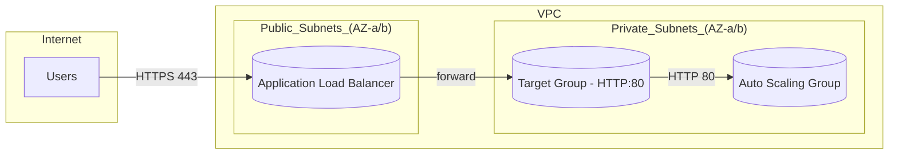

# Resilient Web Tier on AWS — ALB + Auto Scaling (Design-as-Code)

## 🎯 Goal
Translate Elastic Load Balancing + Auto Scaling fundamentals into a **production-grade blueprint** that is deployable later.  
**Phase-1 is plan-only** to keep operational cost at zero, while establishing architecture, documentation, and IaC structure.

## 📦 Scope (Phase-1 Only)
- Application Load Balancer (ALB): Listeners, Rules, Actions, TLS offloading (ACM), optional stickiness.
- Target Groups (HTTP), Health Checks, Deregistration Delay.
- Cross-Zone Load Balancing (ALB).
- Auto Scaling Group (ASG) + Launch Template.
- Lifecycle Hooks (Pending:Wait / Terminating:Wait).
- Termination Policies oriented to AZ balance.
- Observability hooks (CloudWatch metrics) **by design**.
- Security boundary: ALB SG → ASG SG only.

> Out of scope in Phase-1: CI/CD, containerization, K8s, real apply; these arrive in Phase-2.

## 📐 Architecture (High-Level)
- ALB in **public subnets** across ≥2 AZs.
- ASG in **private subnets** across the same AZs.
- TG Health Check: `GET /health` expecting `200–399`.
- TLS: Offloaded at ALB using ACM with SNI (when actually deployed).
- Prefer stateless apps; stickiness optional and short-lived if used.

> The architecture diagram will be added in `diagrams/architecture.mmd` as part of Step-2.

## 🗺️ Architecture Diagram

## 🔒 Security Model
- **ALB Security Group**: allow inbound `443/tcp` from the internet; egress open.
- **ASG Security Group**: allow inbound `80/tcp` **only** from the ALB SG; no public ingress.
- NACLs follow least privilege; note NLB has no SG (not used in Phase-1).

## 🧭 NFRs → Design Mapping
| NFR | Design Decision | Rationale/Impact |
|-----|------------------|------------------|
| High Availability | ALB across ≥2 subnets in ≥2 AZs | Removes single points of failure at the LB layer |
| Resilience | TG Health Checks + Deregistration Delay | Route only to healthy targets; protect in-flight sessions |
| Elasticity | ASG with policy (Target Tracking in Phase-2) | Automatic right-sizing to load |
| Security | ALB SG → ASG SG boundary | Enforces least privilege between tiers |
| Observability | CloudWatch metrics by design; Access Logs optional | Enables performance and health visibility |
| Cost Control | **plan-only** in Phase-1 + tagging (`TTL`, `Project`) | Zero operational cost now; traceable later |

## 📏 Acceptance Criteria (Phase-1)
- Architecture goals/constraints/NFRs documented.
- Health Check, Deregistration Delay, Cross-Zone, Lifecycle & Termination described.
- Security boundary prevents any public ingress to ASG.
- ADR-001 (LB choice) exists with **Accepted** status.
- GitHub Issue/PR templates included and used.

## 📊 KPIs
- Explain the LB choice and ASG integration in ≤ 90 seconds, accurately.
- Map every NFR to ≥ 1 explicit design decision.
- Repo passes `terraform validate` and `terraform plan` without errors when IaC is added (later in Phase-1).

## 📝 Assumptions
- VPC and subnets exist or will be created via a module later (out of Phase-1).
- ACM/TLS will be provisioned during real deployment (outside Phase-1).

## 🏷️ Tagging (Cost & Ownership)
`Project=elb-asg-blueprint`, `Owner=naseeb`, `TTL=1h`, `Env=dev`.

## ✅ Step-1 Checklist
- [ ] This README customized and committed.
- [ ] `docs/adr/ADR-001-alb-vs-nlb.md` added with status **Accepted**.
- [ ] GitHub Issue/PR templates added under `.github/`.
- [ ] Ready to proceed to Step-2 (architecture diagram).
